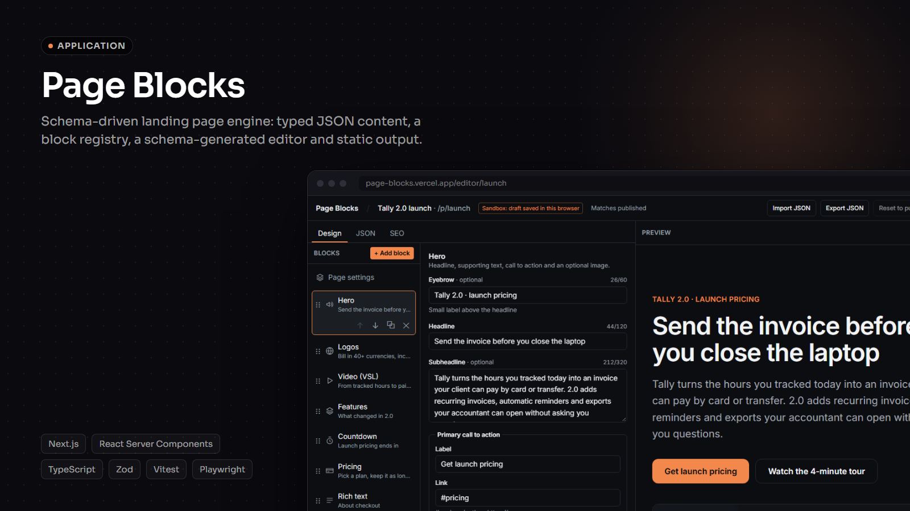
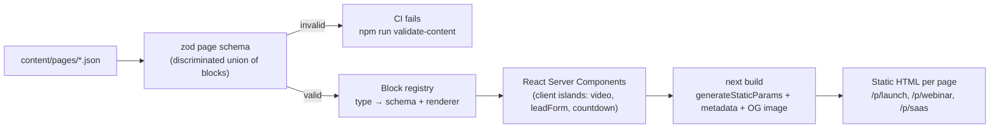
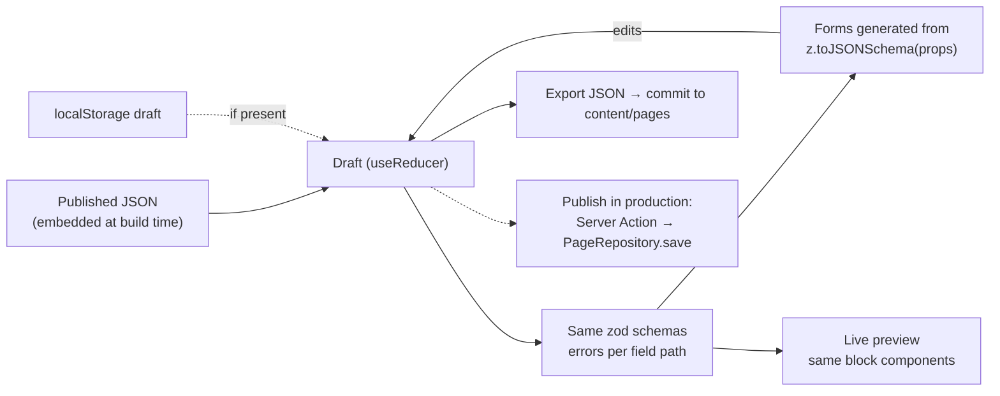

# Page Blocks

Schema-driven landing page engine: pages are versioned JSON documents, rendered by a registry of typed blocks into static HTML, with an editor whose forms are generated from the same zod schemas.

[](https://github.com/trichains/page-blocks/actions/workflows/ci.yml)
[](LICENSE)
[](https://page-blocks.vercel.app)



## Why

Marketing teams launch a lot of pages that look different but are built the same way: a sales page for a launch, a lead capture page for a webinar, a pricing page for a SaaS trial. Hero, proof, offer, FAQ, call to action. When each one is rebuilt in code, every launch waits on a developer. When they're built in a page builder, visitors download a lot of JavaScript for what is mostly static text, and nobody can review a change in a pull request.

Page Blocks sits in between. A page is a JSON file in the repo, checked by a schema in CI. Developers own the blocks (one zod schema and one React component each); marketers fill in content with an editor that is generated from those schemas, export JSON, and the build turns it into static pages. Only the parts that need to be interactive (video player, lead form, countdown) ship JavaScript.

## What it does

- **12 typed blocks**: `hero`, `logos`, `features`, `video`, `testimonials`, `pricing`, `countdown`, `leadForm`, `faq`, `richText`, `cta`, `footer`. Each has a zod v4 schema, a renderer, editor metadata (label, icon, description) and a valid example used when it's added in the editor. Every block can be hidden on mobile or desktop.
- **Page documents** (`content/pages/*.json`): `slug`, `title`, `locale` (`en` / `pt-BR`), `seo`, `theme` (accent, dark/light, radius, font pair), optional `tracking` rules and `blocks`, validated as a discriminated union with exported TypeScript types. Duplicate block ids, unknown block types, unsafe links (`javascript:`), remote images and invalid colors all fail validation with a readable path like `blocks[3].props.plans[1].cta.href`.
- **Static rendering**: `/p/[slug]` uses `generateStaticParams`, `generateMetadata` (title, description, canonical, `noindex`, Open Graph) and a build-time `opengraph-image.tsx` drawn from the page title and accent color. Theme is applied through CSS variables on the page root. Images use `next/image` with explicit `width`/`height` and `sizes`, so media space is reserved and there's no layout shift.
- **Client JS only where needed**: `video` shows a poster and a real `<button>`; the YouTube (`youtube-nocookie.com`) or Vimeo iframe is only created after a click, and nothing plays on load. `faq` is native `<details>/<summary>` with zero JavaScript. `countdown` supports a fixed deadline or an evergreen timer (N hours from the visitor's first visit, stored in a first-party cookie) and always says on the page which one it is.
- **Editor** (`/editor/[slug]`): block list (add from the registry, reorder with up/down buttons or a drag handle, duplicate, delete), a property form generated from the block's zod schema with field-level errors, and a live preview with a mobile/desktop toggle. Tabs for Design, JSON (edit the raw document, applied only when it validates) and SEO (search snippet preview). Import JSON, Export JSON and Reset to published. Drafts persist in `localStorage`.
- **Leads API** (`POST /api/leads`): zod validation, a check against the published form config (required fields, consent), honeypot field, per-IP rate limit, optional forward to `LEADS_WEBHOOK_URL` with a 5 s timeout, and structured JSON logs with a request id.
- **Tracking**: a small `track(name, props)` helper plus one delegated listener. Any element with `data-track="..."` reports clicks (CTAs get `data-track="cta_click"` automatically), and pages can declare extra `view` / `click` / `submit` rules by CSS selector. Events go to `NEXT_PUBLIC_ANALYTICS_ENDPOINT` or the built-in `/api/events` sink, via `sendBeacon`. No tag manager needed.
- **Demo content**: `launch` (product launch sales page with video, evergreen countdown, pricing, FAQ), `webinar` (pt-BR lead capture with a fixed-date countdown, form and testimonials) and `saas` (light theme, editorial fonts, features and pricing). All products and people in the demo are fictional.

## Architecture



Editor flow:



How a request flows: `/`, `/p/[slug]` and `/editor/[slug]` are prerendered at build time from `FileRepository`, so serving a page is serving a static file. At runtime the only server code is `POST /api/leads` (loads the published page to check the form config, then stores in memory or forwards to the webhook) and `POST /api/events`.

The editor preview renders the same block components inside the editor's React tree instead of an iframe fed by `postMessage`. The blocks never touch request APIs, so they work as client components unchanged; the preview updates on every keystroke with no messaging layer, and `/p/[slug]` never has to read `searchParams` (which would make it dynamic). The catch is that media queries respond to the viewport, not to the preview box, so blocks use Tailwind container queries (`@3xl:`) against the page root. That's what makes the 390 px mobile toggle show the real mobile layout.

```
app/
  p/[slug]/page.tsx              static page: generateStaticParams, generateMetadata
  p/[slug]/opengraph-image.tsx   build-time OG image (ImageResponse)
  editor/[slug]/page.tsx         static shell + client-only editor
  api/leads/route.ts             POST lead, GET sandbox listing
  api/events/route.ts            tracking sink
blocks/
  <type>/schema.ts               zod schema + editor meta + example
  <type>/<Component>.tsx         renderer
  definitions.ts                 all schemas and the blockSchema union (no React, runs in CI)
  registry.tsx                   type → renderer (TypeScript fails if one is missing)
components/
  PageRenderer.tsx               theme variables, visibility, block loop
  Tracker.tsx                    delegated click/submit tracking
  editor/                        BlockList, SchemaForm, Preview, JSON/SEO panels, reducer
content/pages/*.json             the pages
lib/
  page-schema.ts                 page document schema and inferred types
  content/repository.ts          PageRepository interface + FileRepository
  markdown.ts                    markdown subset → AST (rendered without innerHTML)
  countdown.ts, rate-limit.ts    pure logic, unit tested
scripts/validate-content.ts      CI content check
```

### Adding a block in 3 steps

1. **Schema**: create `blocks/stats/schema.ts` with `defineBlock({ type: "stats", props: z.object({...}), example, meta })`. Use `.meta({ label, description, multiline, itemLabel })` on fields to steer the generated form.
2. **Renderer**: create `blocks/stats/Stats.tsx` taking `BlockRenderProps<"stats">`. Keep it a Server Component unless it really needs state; style it with the `pb-*` theme tokens and `@` container breakpoints.
3. **Register**: add the definition to `blockDefinitions` and `blockSchema` in `blocks/definitions.ts`, and the component to `blockRenderers` in `blocks/registry.tsx`. TypeScript complains until both are done, and the schema tests pick the new block up automatically (they also ask for a malformed fixture in `tests/unit/block-schemas.test.ts`).

The editor needs no changes: the new block shows up in "Add block" with a generated form.

## Key decisions & trade-offs

- **JSON in git, not a database.** Content changes are reviewed in pull requests, validated in CI and deployed with the code. The cost is that publishing needs a commit and a build. `PageRepository` is the seam: a CMS or database implementation plus a Server Action for "Publish" can replace `FileRepository` without touching blocks or routes.
- **One schema, three uses.** The zod schema validates content files, types the renderer props (`z.infer`) and generates the editor form (`z.toJSONSchema` plus custom `.meta()` keys). Adding a field to a block updates all three.
- **Server Components by default.** 9 of 12 blocks render to plain HTML. FAQ uses `<details>` instead of a JS accordion. The video iframe isn't loaded until someone asks for it.
- **Container queries instead of an iframe preview.** A simpler editor and fully static pages; the trade-off is that blocks must use `@` breakpoints rather than `sm:`/`md:`.
- **Markdown subset with an AST, not a sanitizer.** The parser knows a handful of constructs and outputs React elements, so raw HTML can't get through and there's no `dangerouslySetInnerHTML`. Links are limited to http(s), mailto, `#anchor` and `/path`.
- **Evergreen countdown computed in the browser.** Reading a cookie on the server would make the page dynamic. The timer comes from a first-party cookie and the page says it runs from the visitor's first visit. It's a scarcity timer, not a security boundary: clearing cookies restarts it.
- **In-memory rate limit and sandbox stores.** Fine for a demo and for one long-running server; on serverless each instance has its own memory and resets on cold start. Production should use a shared store (Redis/KV) for the limiter and the webhook (or a database) for leads.
- **The server checks the published form.** `/api/leads` loads the page document and verifies the block exists, is a `leadForm`, and that required fields and consent are present, so a modified client can't skip them.

## Stack

Next.js 16 (App Router, Turbopack), React 19, TypeScript (strict), Tailwind CSS v4, zod v4, Vitest, Playwright, ESLint, Prettier. Fonts via `next/font` (Inter, Fraunces, Space Grotesk). No database, no UI kit.

## Running locally

Requirements: Node 22 or newer, npm.

```bash
npm install
cp .env.example .env.local   # optional, every key is optional
npm run dev                  # http://localhost:3103
```

| Variable                         | Purpose                                                                                                                                |
| -------------------------------- | -------------------------------------------------------------------------------------------------------------------------------------- |
| `LEADS_WEBHOOK_URL`              | Forward each lead as JSON (`{ event: "lead.created", lead }`). When set, leads aren't kept in memory and `GET /api/leads` is disabled. |
| `NEXT_PUBLIC_SITE_URL`           | Absolute URL for canonical links and OG images. Falls back to `VERCEL_PROJECT_PRODUCTION_URL`, then localhost.                         |
| `NEXT_PUBLIC_ANALYTICS_ENDPOINT` | Where `track()` sends events. Defaults to `/api/events`.                                                                               |

Scripts:

```bash
npm run lint              # ESLint
npm run typecheck         # next typegen + tsc --noEmit
npm run validate-content  # validate content/pages/*.json
npm test                  # Vitest: schemas, markdown, countdown, rate limiter, leads, editor, block rendering
npm run build             # production build (/p/* should be listed as ● SSG)
npm run test:e2e          # Playwright against `next start -p 3103` (run the build first)
```

To add a page, put a JSON file in `content/pages/` (the file name is the slug) and run `npm run validate-content`. It then appears on the home page, at `/p/<slug>` and in the editor. The quickest way to write one is to open an existing page in the editor, change it, and use Export JSON.

## Demo & limitations

The public demo runs in sandbox mode:

- Editor drafts live only in your browser's `localStorage`. **Publish is disabled**; Export JSON is how changes get out. In a real setup Publish would be a Server Action calling `PageRepository.save` (a commit through the GitHub API, a CMS write or a database row) followed by revalidation or a rebuild.
- Lead submissions are kept in server memory (last 200) and listed with masked emails and phones at `/api/leads`. Tracked events are at `/api/events`. Both reset on cold start and are per server instance.
- The rate limiter is per instance and in memory, so on serverless it limits less than it suggests.
- Server-side validation messages from `/api/leads` are in English, even on the pt-BR page.
- The editor edits content, theme and SEO; `tracking` rules are edited in the JSON tab. There's no undo beyond Reset to published.
- The demo video is Big Buck Bunny (Blender Foundation, CC BY 3.0) standing in for a product walkthrough.
- There's no auth: anyone can open the editor, which is fine because it can't write anything.

## Roadmap

- A `GitHubRepository` implementation of `PageRepository` that opens a pull request from the editor's Publish button.
- Undo/redo in the editor and a diff view against the published document.
- A/B variants per block, assigned in `proxy.ts` and measured through the tracking helper.
- Shared rate limiting (Redis/KV) and a durable leads store for setups without a webhook.
- Image upload in the editor (today images are paths to files in `public/`).
- Visual regression tests for each block in both themes.

## License

[MIT](LICENSE) © 2026 Cristhian Almeida
