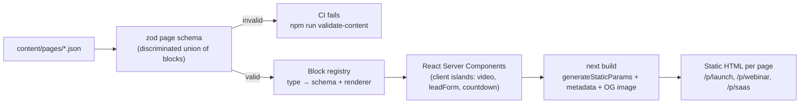
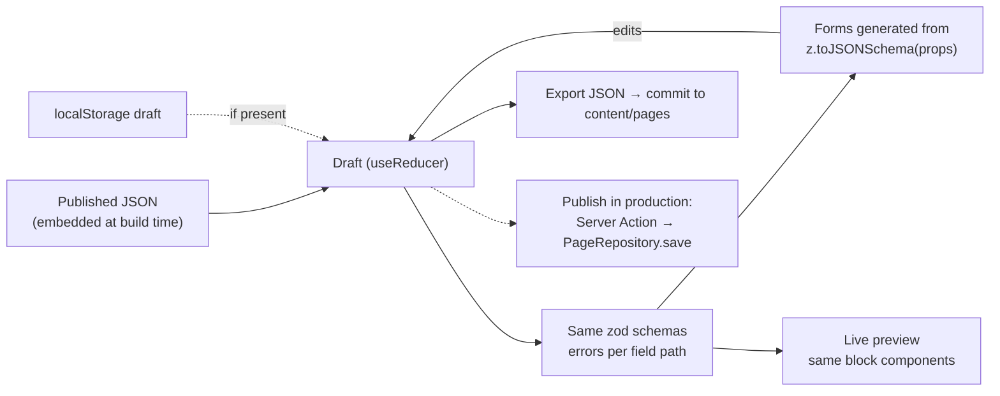

# Page Blocks

[English](README.md) · [Português](README.pt-BR.md)

Engine de landing pages guiada por schema: as páginas são documentos JSON versionados, renderizados em HTML estático por um registry de blocos tipados, com um editor cujos formulários são gerados a partir dos mesmos schemas zod.

[](https://github.com/trichains/page-blocks/actions/workflows/ci.yml)
[](LICENSE)
[](https://page-blocks.vercel.app)


## Por quê

Times de marketing lançam muitas páginas que parecem diferentes mas são montadas do mesmo jeito: uma página de vendas para um lançamento, uma página de captura de leads para um webinar, uma página de preços para o trial de um SaaS. Hero, prova social, oferta, FAQ, chamada para ação. Quando cada uma é refeita em código, todo lançamento fica esperando um dev. Quando são feitas num page builder, o visitante baixa um monte de JavaScript para o que é basicamente texto estático, e ninguém consegue revisar uma mudança num pull request.

O Page Blocks fica no meio do caminho. Uma página é um arquivo JSON no repositório, validado por um schema no CI. Os devs cuidam dos blocos (um schema zod e um componente React cada); o marketing preenche o conteúdo num editor gerado a partir desses schemas, exporta o JSON, e o build transforma isso em páginas estáticas. Só as partes que precisam de interação (player de vídeo, formulário de leads, countdown) enviam JavaScript.

## O que ele faz

- **12 blocos tipados**: `hero`, `logos`, `features`, `video`, `testimonials`, `pricing`, `countdown`, `leadForm`, `faq`, `richText`, `cta`, `footer`. Cada um tem um schema zod v4, um renderer, metadados para o editor (label, ícone, descrição) e um exemplo válido usado quando ele é adicionado no editor. Qualquer bloco pode ser escondido no mobile ou no desktop.
- **Documentos de página** (`content/pages/*.json`): `slug`, `title`, `locale` (`en` / `pt-BR`), `seo`, `theme` (cor de destaque, dark/light, raio, par de fontes), regras opcionais de `tracking` e `blocks`, validados como uma discriminated union com tipos TypeScript exportados. IDs de bloco duplicados, tipos de bloco desconhecidos, links inseguros (`javascript:`), imagens remotas e cores inválidas falham na validação com um caminho legível como `blocks[3].props.plans[1].cta.href`.
- **Renderização estática**: `/p/[slug]` usa `generateStaticParams`, `generateMetadata` (título, descrição, canonical, `noindex`, Open Graph) e um `opengraph-image.tsx` gerado no build a partir do título da página e da cor de destaque. O tema é aplicado com variáveis CSS na raiz da página. As imagens usam `next/image` com `sizes` e `width`/`height` explícitos ou uma caixa fixa `aspect-video` (poster do vídeo), então o espaço da mídia fica reservado e não há layout shift.
- **JS no cliente só onde precisa**: `video` mostra um poster e um `<button>` de verdade; o iframe do YouTube (`youtube-nocookie.com`) ou do Vimeo só é criado depois de um clique, e nada toca ao carregar. `faq` é `<details>/<summary>` nativo, sem nenhum JavaScript. `countdown` aceita um prazo fixo ou um timer evergreen (N horas a partir da primeira visita, guardado num cookie first-party) e sempre informa na página qual dos dois está em uso.
- **Editor** (`/editor/[slug]`): lista de blocos (adicionar a partir do registry, reordenar com botões de subir/descer ou por arrastar, duplicar, excluir), formulário de propriedades gerado a partir do schema zod do bloco com erros por campo, e preview ao vivo com alternância mobile/desktop. Abas Design, JSON (edita o documento bruto, aplicado só quando valida) e SEO (preview do resultado de busca). Import JSON, Export JSON e Reset to published. Os rascunhos ficam salvos no `localStorage`.
- **API de leads** (`POST /api/leads`): validação com zod, conferência contra a configuração publicada do formulário (campos obrigatórios, consentimento, `listId`, quais campos são guardados), campo honeypot que recebe a mesma resposta `201` de um envio real, rate limit por IP, encaminhamento opcional para `LEADS_WEBHOOK_URL` com timeout de 5 s e logs JSON estruturados com request id.
- **Tracking**: um helper pequeno `track(name, props)` mais um único listener delegado. Qualquer elemento com `data-track="..."` registra cliques (os CTAs ganham `data-track="cta_click"` automaticamente), e as páginas podem declarar regras extras de `view` / `click` / `submit` por seletor CSS. Os eventos vão para `NEXT_PUBLIC_ANALYTICS_ENDPOINT` ou para o endpoint embutido `/api/events`, via `sendBeacon`. Sem precisar de tag manager.
- **Conteúdo de demonstração**: `launch` (página de vendas de lançamento com vídeo, countdown evergreen, preços, FAQ), `webinar` (captura de leads em pt-BR com countdown de data fixa, formulário e depoimentos) e `saas` (tema claro, fontes editoriais, features e preços). Todos os produtos e pessoas da demo são fictícios.

## Arquitetura



Fluxo do editor:



Como uma requisição flui: `/`, `/p/[slug]` e `/editor/[slug]` são pré-renderizados no build a partir do `FileRepository`, então servir uma página é servir um arquivo estático. Em runtime, o único código de servidor é o `POST /api/leads` (carrega a página publicada para conferir a configuração do formulário e depois guarda em memória ou encaminha para o webhook) e o `POST /api/events`.

O preview do editor renderiza os mesmos componentes de bloco dentro da árvore React do editor, em vez de um iframe alimentado por `postMessage`. Os blocos nunca usam APIs de request, então funcionam como client components sem nenhuma mudança; o preview atualiza a cada tecla sem camada de mensagens, e `/p/[slug]` nunca precisa ler `searchParams` (o que deixaria a rota dinâmica). O porém é que media queries respondem ao viewport, não à caixa do preview, então os blocos usam container queries do Tailwind (`@3xl:`) em relação à raiz da página. É isso que faz a alternância mobile de 390 px mostrar o layout mobile de verdade.

```
app/
  p/[slug]/page.tsx              static page: generateStaticParams, generateMetadata
  p/[slug]/opengraph-image.tsx   build-time OG image (ImageResponse)
  editor/[slug]/page.tsx         static shell + client-only editor
  api/leads/route.ts             POST lead, GET sandbox listing
  api/events/route.ts            tracking sink
blocks/
  <type>/schema.ts               zod schema + editor meta + example
  <type>/<Component>.tsx         renderer
  definitions.ts                 all schemas and the blockSchema union (no React, runs in CI)
  registry.tsx                   type → renderer (TypeScript fails if one is missing)
components/
  PageRenderer.tsx               theme variables, visibility, block loop
  Tracker.tsx                    delegated click/submit tracking
  editor/                        BlockList, SchemaForm, Preview, JSON/SEO panels, reducer
content/pages/*.json             the pages
lib/
  page-schema.ts                 page document schema and inferred types
  content/repository.ts          PageRepository interface + FileRepository
  markdown.ts                    markdown subset → AST (rendered without innerHTML)
  countdown.ts, rate-limit.ts    pure logic, unit tested
scripts/validate-content.ts      CI content check
```

### Adicionando um bloco em 3 passos

1. **Schema**: crie `blocks/stats/schema.ts` com `defineBlock({ type: "stats", props: z.object({...}), example, meta })`. Use `.meta({ label, description, multiline, itemLabel })` nos campos para orientar o formulário gerado.
2. **Renderer**: crie `blocks/stats/Stats.tsx` recebendo `BlockRenderProps<"stats">`. Mantenha como Server Component, a não ser que ele realmente precise de estado; estilize com os tokens de tema `pb-*` e os breakpoints de container `@`.
3. **Registro**: adicione a definição em `blockDefinitions` e `blockSchema` no `blocks/definitions.ts`, e o componente em `blockRenderers` no `blocks/registry.tsx`. O TypeScript reclama até as duas coisas estarem feitas, e os testes de schema pegam o novo bloco automaticamente (eles também pedem uma fixture malformada em `tests/unit/block-schemas.test.ts`).

O editor não precisa de mudança: o novo bloco aparece em "Add block" com um formulário gerado.

## Decisões e trade-offs

- **JSON no git, não num banco de dados.** Mudanças de conteúdo são revisadas em pull requests, validadas no CI e publicadas junto com o código. O custo é que publicar exige um commit e um build. `PageRepository` é o ponto de troca: uma implementação com CMS ou banco mais uma Server Action para o "Publish" pode substituir o `FileRepository` sem mexer nos blocos nem nas rotas.
- **Um schema, três usos.** O schema zod valida os arquivos de conteúdo, tipa as props do renderer (`z.infer`) e gera o formulário do editor (`z.toJSONSchema` mais chaves customizadas de `.meta()`). Adicionar um campo num bloco atualiza os três.
- **Server Components por padrão.** 9 dos 12 blocos viram HTML puro. O FAQ usa `<details>` em vez de um accordion em JS. O iframe do vídeo só carrega quando alguém pede.
- **Container queries em vez de um preview em iframe.** Editor mais simples e páginas totalmente estáticas; o trade-off é que os blocos precisam usar breakpoints `@` em vez de `sm:`/`md:`.
- **Subconjunto de markdown com AST, não um sanitizer.** O parser conhece um punhado de construções e gera elementos React, então HTML bruto não passa e não existe `dangerouslySetInnerHTML`. Links ficam limitados a http(s), mailto, `#anchor` e `/path`.
- **Countdown evergreen calculado no navegador.** Ler um cookie no servidor deixaria a página dinâmica. O timer vem de um cookie first-party e a página avisa que ele conta a partir da primeira visita. É um timer de escassez, não uma barreira de segurança: limpar os cookies reinicia a contagem.
- **Rate limit e armazenamento do sandbox em memória.** Serve para uma demo e para um servidor de longa duração; em serverless cada instância tem a própria memória e zera no cold start. Em produção, use um store compartilhado (Redis/KV) para o limiter e o webhook (ou um banco) para os leads.
- **O servidor confere o formulário publicado.** `/api/leads` carrega o documento da página e verifica se o bloco existe, se é um `leadForm` e se os campos obrigatórios e o consentimento estão presentes. Ele guarda só os campos que o formulário pede e pega o `listId` da página, então um cliente modificado não consegue pular campos nem mandar o lead para outra lista.

## Stack

Next.js 16 (App Router, Turbopack), React 19, TypeScript (strict), Tailwind CSS v4, zod v4, Vitest, Playwright, ESLint, Prettier. Fontes via `next/font` (Inter, Fraunces, Space Grotesk). Sem banco de dados, sem UI kit.

## Rodando localmente

Requisitos: Node 22 ou mais recente, npm.

```bash
npm install
cp .env.example .env.local   # optional, every key is optional
npm run dev                  # http://localhost:3103
```

| Variável                         | Para que serve                                                                                                                                       |
| -------------------------------- | ---------------------------------------------------------------------------------------------------------------------------------------------------- |
| `LEADS_WEBHOOK_URL`              | Encaminha cada lead como JSON (`{ event: "lead.created", lead }`). Quando definida, os leads não ficam em memória e o `GET /api/leads` é desativado. |
| `NEXT_PUBLIC_SITE_URL`           | URL absoluta para links canonical e imagens OG. Se vazia, usa `VERCEL_PROJECT_PRODUCTION_URL` e depois localhost.                                    |
| `NEXT_PUBLIC_ANALYTICS_ENDPOINT` | Para onde o `track()` envia os eventos. O padrão é `/api/events`.                                                                                    |

Scripts:

```bash
npm run lint              # ESLint
npm run typecheck         # next typegen + tsc --noEmit
npm run validate-content  # validate content/pages/*.json
npm test                  # Vitest: schemas, markdown, countdown, rate limiter, leads, editor, block rendering
npm run build             # production build (/p/* should be listed as ● SSG)
npm run test:e2e          # Playwright against `next start -p 3103` (run the build first)
```

Para adicionar uma página, coloque um arquivo JSON em `content/pages/` (o nome do arquivo é o slug) e rode `npm run validate-content`. Ela passa a aparecer na home, em `/p/<slug>` e no editor. O jeito mais rápido de escrever uma é abrir uma página existente no editor, alterar e usar o Export JSON.

## Demo e limitações

A demo pública roda em modo sandbox:

- Os rascunhos do editor ficam só no `localStorage` do seu navegador. **O Publish está desativado**; o Export JSON é a forma de tirar as mudanças de lá. Num cenário real, o Publish seria uma Server Action chamando `PageRepository.save` (um commit pela API do GitHub, uma escrita no CMS ou uma linha no banco), seguida de revalidação ou de um novo build.
- Os envios de leads ficam na memória do servidor (os últimos 200) e são listados com nome, e-mail e telefone mascarados em `/api/leads`. Os eventos rastreados ficam em `/api/events`. Os dois zeram no cold start e são por instância de servidor.
- O rate limiter é por instância e em memória, então em serverless ele limita menos do que parece. Ele usa o primeiro endereço do `x-forwarded-for`, que é confiável atrás do proxy da Vercel mas pode ser forjado se o app ficar exposto diretamente; sem headers de proxy, todos os clientes dividem o mesmo bucket.
- O `<html lang>` da raiz é `en` em todas as rotas; a página em pt-BR define `lang="pt-BR"` na raiz da página, o que cobre o conteúdo mas não o elemento do documento.
- As mensagens de validação do servidor em `/api/leads` são em inglês, mesmo na página em pt-BR.
- O editor edita conteúdo, tema e SEO; as regras de `tracking` são editadas na aba JSON. Não há desfazer além do Reset to published. Um rascunho salvo no seu navegador tem prioridade sobre uma versão publicada mais nova até você resetar.
- O vídeo da demo é o Big Buck Bunny (Blender Foundation, CC BY 3.0), usado no lugar de um walkthrough do produto.
- Não há autenticação: qualquer pessoa pode abrir o editor, o que não é problema porque ele não consegue gravar nada.

## Roadmap

- Uma implementação `GitHubRepository` de `PageRepository` que abre um pull request a partir do botão Publish do editor.
- Desfazer/refazer no editor e uma visão de diff em relação ao documento publicado.
- Variantes A/B por bloco, atribuídas no `proxy.ts` e medidas pelo helper de tracking.
- Rate limit compartilhado (Redis/KV) e um armazenamento durável de leads para setups sem webhook.
- Upload de imagens no editor (hoje as imagens são caminhos para arquivos em `public/`).
- Testes de regressão visual para cada bloco nos dois temas.

## Licença

[MIT](LICENSE) © 2026 Cristhian Almeida
